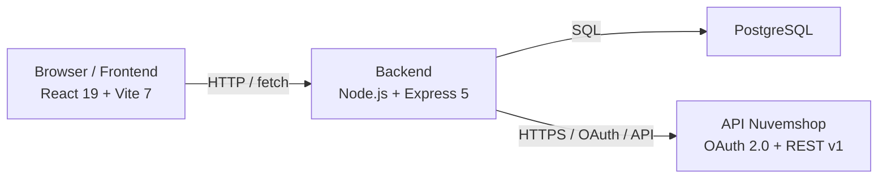

# Arquitetura do Projeto — CustomGlass North Vision

Este documento descreve a arquitetura do sistema e a organização dos diretórios.

## Visão geral

O projeto é um monorepo dividido em duas grandes partes:

- `frontend/` — interface web construída com React 19 e Vite 7.
- `backend/` — API REST construída com Node.js, Express 5 e PostgreSQL.

## Diagrama de arquitetura

## Camadas do backend

O backend segue uma arquitetura em camadas:

- `routes/` — definição de endpoints HTTP e aplicação de middlewares.
- `controllers/` — validação de entrada e montagem das respostas.
- `services/` — lógica de negócio, integração com Nuvemshop e geração de JWT.
- `models/` — acesso ao banco de dados, consultas SQL e persistência.
- `config/` — configuração de conexão com PostgreSQL.
- `middleware/` — autenticação JWT, autorização e logging de requisições.

## Arquivos principais do backend

| Localização | Propósito |
|-------------|-----------|
| `backend/src/server.js` | Ponto de entrada do servidor Express, configura rotas e middlewares. |
| `backend/src/config/database.js` | Configura o pool de conexões PostgreSQL e encapsula execução de queries. |
| `backend/src/routes/auth.routes.js` | Rotas relacionadas à autenticação e OAuth com Nuvemshop. |
| `backend/src/routes/productRoutes.js` | Rotas relacionadas a produtos, categorias e checkout. |
| `backend/src/controllers/authController.js` | Controlador do fluxo de login, criação de lojista e OAuth callback. |
| `backend/src/controllers/productController.js` | Controlador de produtos públicos e checkout personalizado. |
| `backend/src/services/auth.service.js` | Lógica de OAuth, geração/validação de JWT e autenticação de lojistas. |
| `backend/src/services/nuvemshopService.js` | Integração com a API Nuvemshop, busca de produtos e criação de pedidos. |
| `backend/src/models/store.model.js` | Persistência de lojas, tokens e informações de integração no banco. |

## Frontend

O frontend é uma SPA React que consome a API backend. A navegação é controlada por `react-router-dom`.

### Arquivos principais do frontend

| Localização | Propósito |
|-------------|-----------|
| `frontend/src/main.jsx` | Ponto de entrada do React. |
| `frontend/src/App.jsx` | Define as rotas da aplicação. |
| `frontend/src/pages/Home/Home.jsx` | Página inicial com catálogo público. |
| `frontend/src/pages/ProductPage/productPage.jsx` | Página de personalização do produto. |
| `frontend/src/pages/AuthCallback/AuthCallback.jsx` | Constrói o fluxo de retorno do OAuth. |
| `frontend/src/pages/Lojista/LojistaLogin.jsx` | Login/cadastro do lojista. |
| `frontend/src/pages/Lojista/LojistaAdmin.jsx` | Painel do lojista e integração com a loja. |
| `frontend/src/components/OAuthButton.jsx` | Botão que inicia o OAuth com Nuvemshop. |
| `frontend/src/services/api.js` | Camada de comunicação HTTP com o backend. |

## Banco de dados

O banco de dados PostgreSQL armazena:

- lojistas (`users`)
- lojas integradas (`stores`)
- tokens de acesso `nuvemshop_access_token`

A configuração de conexão é carregada de `.env` no backend.

## Variáveis de ambiente

Principais variáveis usadas pelo backend:

- `DB_HOST`, `DB_PORT`, `DB_NAME`, `DB_USER`, `DB_PASSWORD`
- `NUVEMSHOP_CLIENT_ID`, `NUVEMSHOP_CLIENT_SECRET`
- `NUVEMSHOP_REDIRECT_URI`
- `JWT_SECRET`
- `ADMIN_SECRET`
- `FRONTEND_URL`
- `STORE_PUBLIC_URL`

> O arquivo `.env` deve ser mantido fora do controle de versão.
