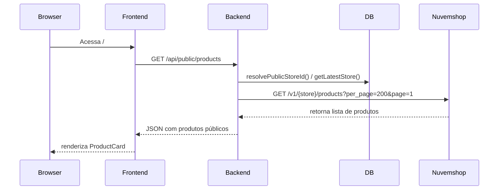
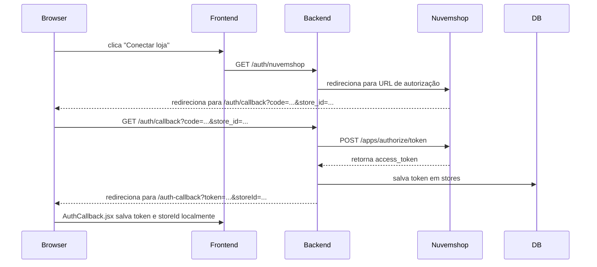
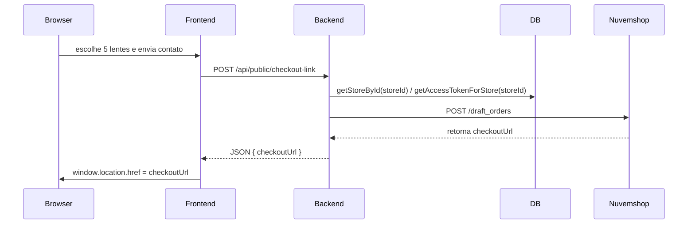
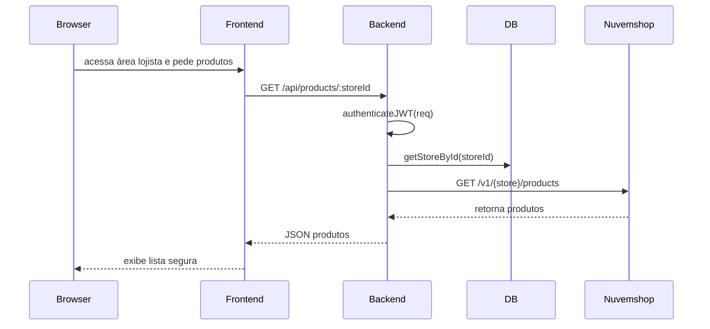

# Fluxos de Dados — CustomGlass North Vision

Neste documento estão os principais fluxos do sistema descritos com diagramas Mermaid.

## Fluxo 1 — Vitrine Pública

## Fluxo 2 — OAuth 2.0 (Instalação pelo lojista)

## Fluxo 3 — Checkout Personalizado

## Fluxo 4 — Produtos Autenticados do Lojista

## Observações

- O frontend usa `localStorage` para armazenar `authToken` e `storeId` após o OAuth.
- O backend mantém o `access_token` da Nuvemshop só no banco, evitando exposição ao navegador.
- A autenticação JWT é usada apenas para rotas protegidas, enquanto as rotas públicas podem ser acessadas sem token.
